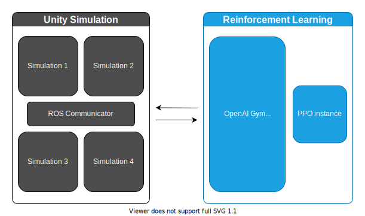

<!-- CSS styles -->

## 2023

<!-- Master Thesis -->

### Attention Mechanism in Neuromorphic Vision

_[Neuromorphic Computing Team, Fortiss](https://www.fortiss.org/en/research/fields-of-research/detail/neuromorphic-computing)_

- Supervised by Evan Eames
- Designing an **attention-based** vision pipeline for robotic control
- Implementing **spiking neural networks** on the neuromophic chip **Loihi 2**
- Evaluating the pipeline on a **Kuka** arm simulated in **MuJoCo**

<!-- BMW internship -->

### Computer Vision for DC Partial Discharge Diagnostics in Traction Battery Systems

_[Battery Cell Competence Center, BMW AG](https://www.bmwgroup.com/en/general/approach-battery-cell-competence-centre.html)_

- Supervised by Ivo Freudenberg and Maximilian Kertel
- Designed a proof of concept for **fast detection & classification** of insulation faults in **battery cells**
- Converted temporal voltage data into **phase resolved partial discharge** plots
- Compared the efficiency of several algorithms including **Support Vector Machine**, **Random Forest** and **Convolutional Neural Networks**

  

    
    
 The coherence of the predictions made by the models was evaluated using the explainable AI technique LIME 

  

## 2022

<!-- IDP -->

### Learning Human Motion Models using Approximate Inverse Reinforcement Learning and Lyapunov Stability Theory

_[Lehrstuhl für Informationstechnische Regelung, TU München](https://www.ce.cit.tum.de/en/itr/home/)_

- Supervised by Samuel Tesfazgi
- Learnt implicit cost functions of manipulation experiments following **inverse reinforcement learning** principles
- Certified the stability of the learnt cost functions using **Lyapunov theory** and **PAC bounds**
- Implemented cost functions based on **RKHS** and **neural network** models.

  

    
    
 An example of learnt cost function 

  

  

     
    
 Learnt cost functions allow to generalize demonstration data 

  

### Robustness of Machine Learning Models

_[Data Analytics and Machine Learning Group, TU München](https://www.cs.cit.tum.de/daml/startseite/)_

- Topic offered by Stephan Günnemann in lecture _Machine Learning for Graphs and Sequential Data_
- Carried out **adversarial attacks** on a neural network trained on MNIST dataset
- Trained a **robust neural network** with improved resistance to perturbations
- Provided **theoretical guarantees** on the robustness gain

  

    
    
 A CNN network is trained and reaches 92% accuracy on the validation set

  

  

    

      
      
    

    
A small perturbation misleads the trained model

  

## 2021

<!-- DAISE -->

### Data Analytics and Intelligent Systems in Energy Informatics

_[Lehrstuhl für Anwendungs- und Middlewaresysteme, TU München](https://www.cs.cit.tum.de/msrg/home/)_

- Collaborated with Cara Dickmann & Joshua Wendland; supervised by René Schwermer
- Focused on short-term **wind turbine power prediction** using Engie's La Haute Borne dataset
- Designed several models based on **support vector regression**, with hyper parameters optimized via a **genetic algorithm**
- Compared the efficiency of direct wind power prediction to that of a physical model of wind turbine power based on wind speed prediction
- Wrote a scientific report following **ACM Conference** requirements

  

    
    
 The predictions of the two models compared to the ground truth

  

<!-- CMLR -->

### Cloud-Based Machine Learning in Robotics

_[Lehrstuhl für Robotik, Künstliche Intelligenz und Echtzeitsysteme, TU München](https://www.ce.cit.tum.de/en/air/home/)_

- Collaborated with Felix Hartwig, Skander Krid & Tobias Piltz; supervised by Josip Josifovski & Florian Walter
- Aimed to solve a **pick & place** task using **Reinforcement Learning**.
- Developed a training environement based on a pre-existing **Unity** simulation
- Implemented and tuned an instance of **Proximal Policy Optimization**
- Parallelized training on a **computer cluster**

  

    
    
 The functionalities are split among the Simulation   and the Reinforcement Learning containers

  

  

    
    
 Trained Reach & Pick demonstrator

  

<!-- AMF -->

### Who are the High-Frequency Traders ?

_[Autorité des Marchés Financiers](https://www.amf-france.org/en) and [CMAP, École Polytechnique](https://portail.polytechnique.edu/cmap/en)_

- Collaborated with Jean-Charles Layoun; topic offered by Erwan Le Pennec in lecture _Regression and Classification_
- **Classified market players** between high-frequency, non high-frequency and mix traders
- Cleaned and preprocessed **noisy trading data**
- Designed several models based on **Gradient Boosting**, **Random Forest** and **Deep Neural Network** methods
- Reached **1st place** among 67 teams

  

    
     
PCA shows a non-HFT free zone,   while Mix and HFT interleave

  

  

     
    
Learning curves of the deep neural network;  validation is done on future data 

  

## 2020

<!-- Twitter challenge -->

### Covid-19 Retweet Prediction

_[Data Science and Mining group, École Polytechnique](http://www.lix.polytechnique.fr/dascim/)_

- Collaborated with Jean-Charles Layoun & Antonin Vidon; topic offered by Michalis Varzirgiannis in lecture _Machine and Deep Learning_
- Aimed to predict the **number of retweets** of tweets dealing with the Covid pandemic
- Cleaned and preprocessed noisy tweet metadata
- Used pre-trained **BERT** to encode tweet texts and perform **sentiment analysis**
- Trained a **dense neural network** to predict the number of retweets

  

    
    
 Correlation of tweet metadata 

  

  

     
    
 Final architecture of the dense network

  

<!-- Covid 19 Modal -->

### The Covid-19 Pandemic on Twitter

_[CEDAR: Rich Data Exploration at Cloud Scale, Inria Saclay](https://team.inria.fr/cedar/)_

- Collaborated with Lucie Wang; supervised by Oana Balalau
- Collected nearly two hundred thousand **Covid-related tweets** using Twitter's API
- Built the weighted **co-occurence graph** of words contained in the tweet dataset
- Clustered word nodes thanks to the software **Gephi** and computed **sentiment and objectivity scores**
- Identified and analyzed **meaningful clusters**

  

    
    
 4 main clusters are identified: Debate, Community, News and Lifestyle

  

  

     
    
 The centrality and rank of each word is measured

  

## 2019

 <!-- PSC -->

### Voxel Physics: Learning Physics thanks to Video Games

_[Ubisoft](https://www.ubisoft.com/en-us/) and [Chaire Science & Jeux vidéo, École Polytechnique](https://sciencexgames.fr/)_

- Collaborated with Honoré Bouy, Paul Calot, Jean-Charles Layoun & Antonin Vidon; supervised by Raphaël Granier de Cassagnac & David Louapre
- Designed a **video game prototype** embedding highly original **physical phenomena** such as heat propagation and corrosion
- Encouraged players to discover **phenomenal interactions** to design efficient strategies
- Awarded **Best Collective Scientific Project 2020** by École
  Polytechnique's jury

  

    <video class="video" controls>
      <source src="images/psc-voxels/video_12_methode_du_polytechnicien.mp4" type="video/mp4">
    </video>
    
 A strategy combining efficiently all available physical phenomena 

  

## 2018

 <!-- TIPE -->

### Study of the Energetic Benefits of the Use of Hydrofoils

_[Classe MP\*, Collège Stanislas](https://www.stanislas.fr/presentation-des-filieres-de-la-prepa-de-stanislas)_

- Collaborated with Charles Galdin; supervised by Philippe Desportes
- Conducted a **literature review** of hydrofoil models
- Designed a basic **simulation** of the move of a sailboat equipped with hydrofoils
- Compared simulational results with a **reduced-scale experiment**

  

    <video class="video" controls>
      <source src="images/hydrofoil/dragged_foiler.mp4" type="video/mp4">
    </video>
    
 The experiment allowed to compare the energetic efficiency of the archimedian boat to that of the foiler

  

